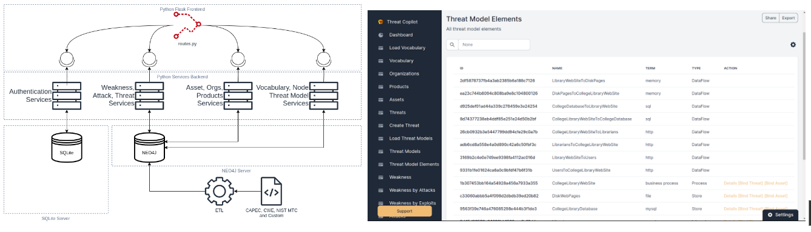
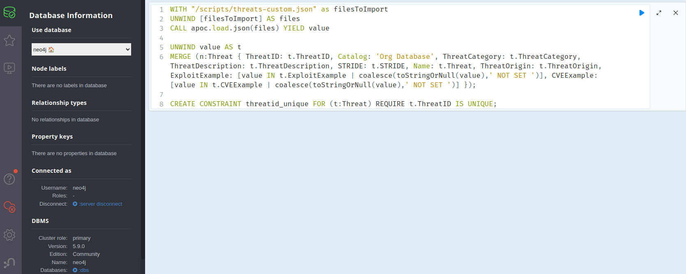
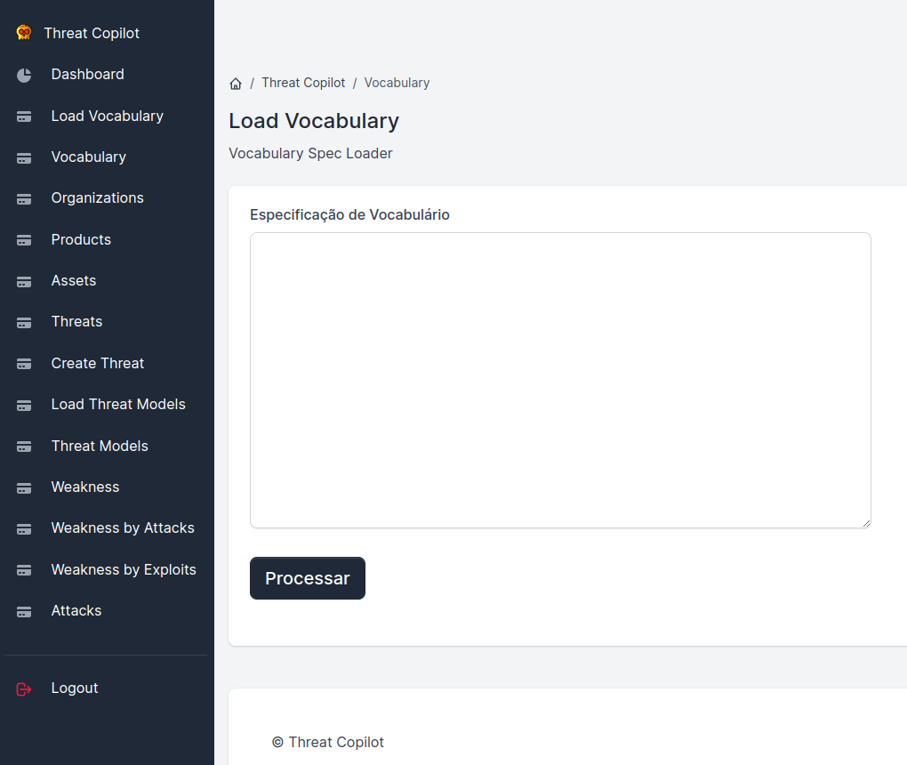
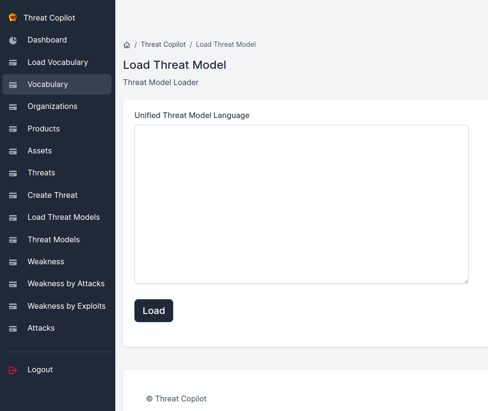

#  Threat Copilot


Possui o objetivo facilitar a adoção da modelagem de ameaças por times ágeis de desenvolvimento em organizações. Para isso, a ferramenta armazena e in tegra os modelos de ameaças com os repositórios de produtos, de ativos e com as bases de dados de conhecimento sobre fraquezas (CWE), ataques (CAPEC) e ameaças (Mobile Threat Catalog).


Figura. Arquitetura e Tela do Threat Copilot

# Pré-Requisitos

* Sistema Operacional
    * Ubuntu Linux 22.04 ou superior
* Docker
    * Docker 24.0.2 ou superior
* Python 3.9 ou superior
* Neo4J 5.9.0 ou superior
* Google Chrome 114 ou similar (Suporte a Javascript)
* ChromeWebDriver

# Instalação (Linux)
1. Realize o download do branch principal do projeto
2. Descompacte no diretório escolhido
3. Abra o terminal (na máquina hospedeira) no diretório escolhido
4. Transforme os scripts de inicialização em executáveis
```
chmod +x build_docker_image.sh build_docker_image.sh run_app.sh start.sh
```
5. Realize o build local da imagem docker do Threat Copilot 
```
./build_docker_image.sh
```
6. Execute o docker compose para iniciar o Threat Copilot
```
./run_app.sh
```
Observações: 
* Algumas instalações do docker podem exigir o uso do SUDO para a execução dos comandos.  Caso a sua seja necessário utilize o utilitário. 
* Recomendamos o uso do Portainer para auxiliar a administração dos containers. 


# Pós Instalação 

## Carga dos Dados no Neo4j

Para preparar para o uso é necessário realizar uma carga inicial ETL via Cypher:

*User: neo4j / password: your_password (Default Password)*

> [!WARNING]
> Trocar password padrão no docker-compose.yml

1. Abra o console de admin do NEO4J (http://localhost:7474)

 

2. Copie individualmente conteúdo do scripts cypher da pasta (/etl_scripts) para local de execução de scripts e pressione o botão de executar. 
```
etl_scripts/LOAD_ASSETS.cypher
etl_scripts/LOAD_CAPEC.cypher
etl_scripts/LOAD_CWE.cypher
etl_scripts/LOAD_ORGS_PRODUCTS.cypher
etl_scripts/LOAD_THREATS.cypher
etl_scripts/LOAD_THREATS_MTC.cypher
```
3. Entre na aplicação (http://localhost:5085/) Threat Copilot

## Carga dos Dados no Threat Copilot

1. Realize a carga do vocabulário (/kbdata/vocabulary.yml)
 

2. Realize a carga dos modelos de ameaça em UTML
 

# Prova de Conceito
Os dados dos modelos de ameaça foram anonimizados. Por ventura, podem representar algumas diferenças. 

# Para Desenvolvimento

Para executar a aplicação para desenvolvimento utilize os passos abaixo. 

Em um terminal Linux na máquina hospedeira:
1. Inicie o Neo4J via docker 
```
docker compose -f docker-compose-neo4j.yml up
```
2. Crie um ambiente usando o módulo venv do python 
```
python3 -m venv venv
```
3. Habilite o ambiente 
```
source /venv/bin/activate
```
4. Instale as dependencias via PIP 
```
pip install -r requirements.txt
```
5. Inicie a aplicação 
```
gunicorn --config ./gunicorn-cfg.py --reload run:app
```

# Publicações

* NEGOCIO, Y. F., HERTHEL, N. T., MEDEIROS, J. D. Threat Copilot: Um sistemas de recomedação para modelagem de ameaças. VII Salão de Ferramentas. XXIII Simpósio Brasileiro em Segurança da Informação e de Sistemas Computacionais. 2023. 

# Dúvidas e Sugestões
- negocio.yuri@academico.ifpb.edu.br
- yurinegocio@gmail.com
